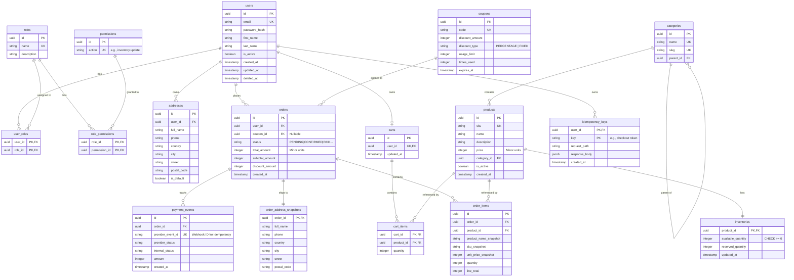

# Entity-Relationship Diagram (ERD)

The following Mermaid.js diagram illustrates the logical database schema for Qubrax. 

```mermaid
erDiagram
    users {
        uuid id PK
        string email UK
        string password_hash
        string first_name
        string last_name
        boolean is_active
        timestamp created_at
        timestamp updated_at
        timestamp deleted_at
    }

    roles {
        uuid id PK
        string name UK
        string description
    }

    permissions {
        uuid id PK
        string action UK "e.g., inventory.update"
    }

    user_roles {
        uuid user_id PK, FK
        uuid role_id PK, FK
    }

    role_permissions {
        uuid role_id PK, FK
        uuid permission_id PK, FK
    }

    addresses {
        uuid id PK
        uuid user_id FK
        string full_name
        string phone
        string country
        string city
        string street
        string postal_code
        boolean is_default
    }

    categories {
        uuid id PK
        string name UK
        string slug UK
        uuid parent_id FK
    }

    products {
        uuid id PK
        string sku UK
        string name
        string description
        integer price "Minor units"
        uuid category_id FK
        boolean is_active
        timestamp created_at
    }

    inventories {
        uuid product_id PK, FK
        integer available_quantity "CHECK >= 0"
        integer reserved_quantity
        timestamp updated_at
    }
    
    carts {
        uuid id PK
        uuid user_id UK, FK
        timestamp updated_at
    }

    cart_items {
        uuid cart_id PK, FK
        uuid product_id PK, FK
        integer quantity
    }

    coupons {
        uuid id PK
        string code UK
        integer discount_amount
        string discount_type "PERCENTAGE | FIXED"
        integer usage_limit
        integer times_used
        timestamp expires_at
    }

    orders {
        uuid id PK
        uuid user_id FK
        uuid coupon_id FK "Nullable"
        string status "PENDING|CONFIRMED|PAID..."
        integer total_amount "Minor units"
        integer subtotal_amount
        integer discount_amount
        timestamp created_at
    }

    order_items {
        uuid id PK
        uuid order_id FK
        uuid product_id FK
        string product_name_snapshot
        string sku_snapshot
        integer unit_price_snapshot
        integer quantity
        integer line_total
    }

    order_address_snapshots {
        uuid order_id PK, FK
        string full_name
        string phone
        string country
        string city
        string street
        string postal_code
    }

    payment_events {
        uuid id PK
        uuid order_id FK
        string provider_event_id UK "Webhook ID for idempotency"
        string provider_status
        string internal_status
        integer amount
        timestamp created_at
    }

    idempotency_keys {
        uuid user_id PK, FK
        string key PK "e.g., checkout token"
        string request_path
        jsonb response_body
        timestamp created_at
    }

    %% Relationships
    users ||--o{ user_roles : "has"
    roles ||--o{ user_roles : "assigned to"
    roles ||--o{ role_permissions : "has"
    permissions ||--o{ role_permissions : "granted to"
    users ||--o{ addresses : "owns"
    
    categories ||--o{ categories : "parent of"
    categories ||--o{ products : "contains"
    products ||--|| inventories : "has"
    
    users ||--o| carts : "owns"
    carts ||--o{ cart_items : "contains"
    products ||--o{ cart_items : "referenced by"
    
    users ||--o{ orders : "places"
    orders ||--o{ order_items : "contains"
    products ||--o{ order_items : "referenced by"
    orders ||--|| order_address_snapshots : "ships to"
    coupons ||--o{ orders : "applied to"
    
    orders ||--o{ payment_events : "tracks"
    users ||--o{ idempotency_keys : "owns"
```
