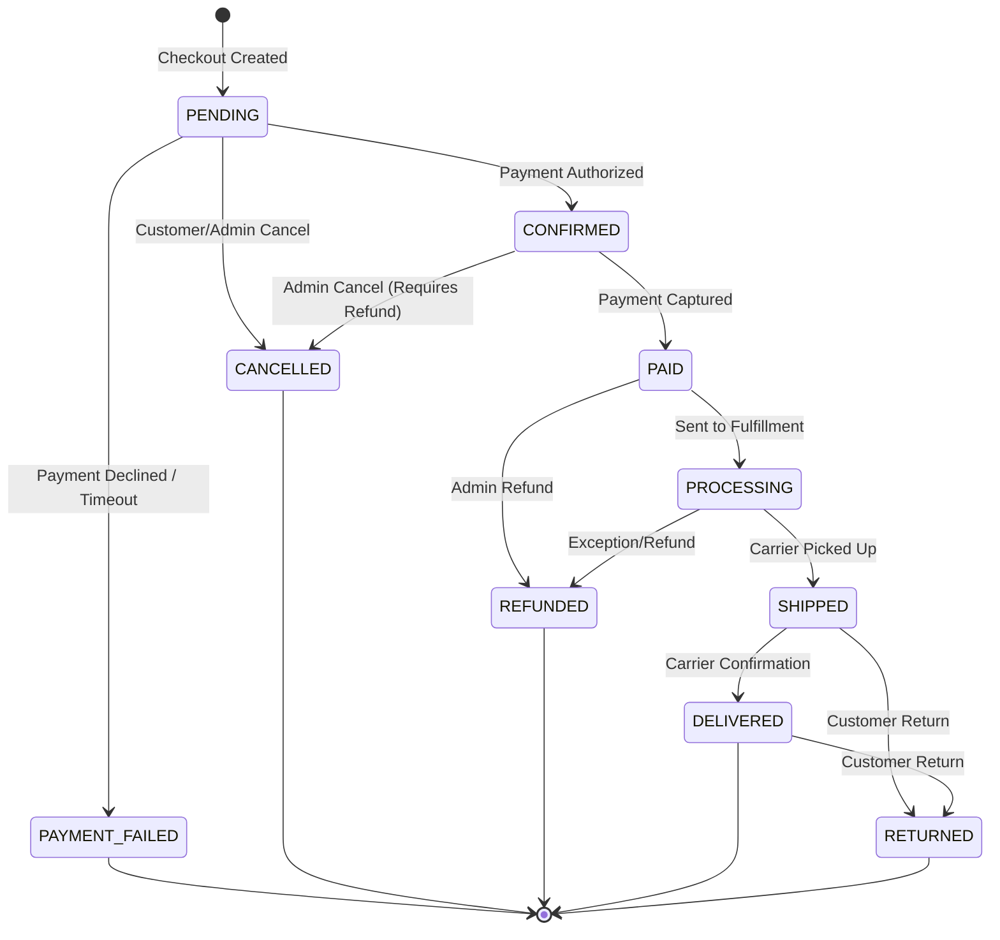
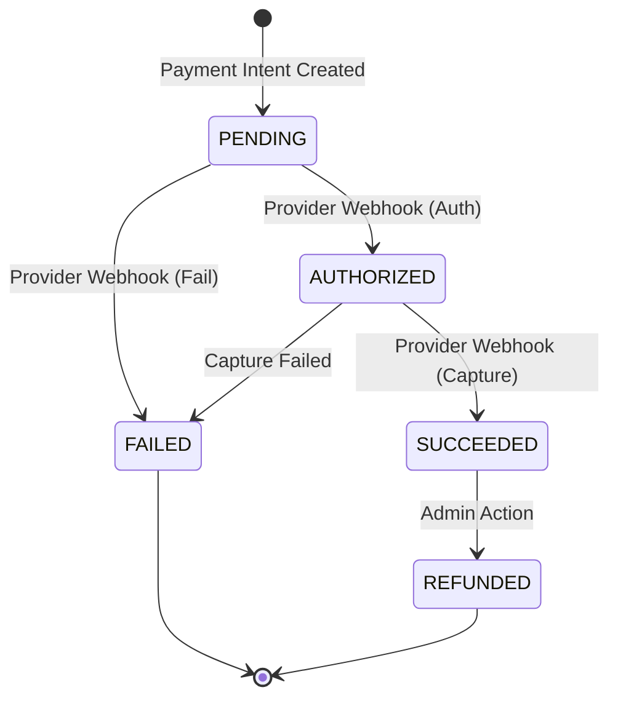
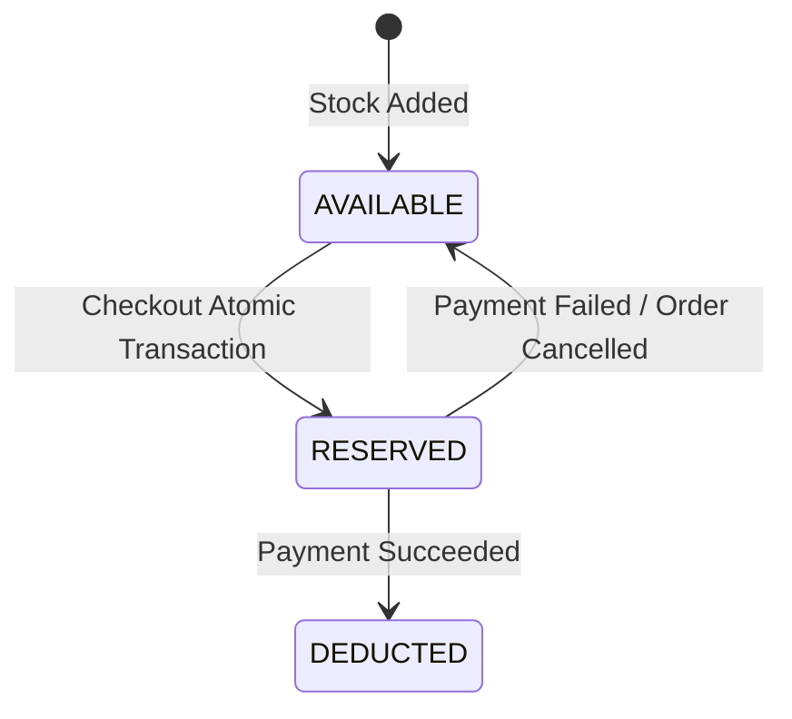

# State Machines

The following Mermaid diagrams define the strict state transitions allowed for core entities in Qubrax. The application layer must reject any transition not explicitly modeled here.

## 1. Order Lifecycle

## 2. Payment Lifecycle

## 3. Inventory Reservation Lifecycle

Inventory is managed via strict mathematical deduction rather than discrete states, but conceptually it follows this flow:

*Implementation Note:* In PostgreSQL, this is often implemented atomically by updating the `available_quantity` during checkout, and logging an `inventory_movement` row to track the logical reservation vs final deduction.
